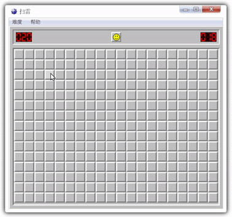

# 扫雷小游戏（mine-sweeper）



[请点击在线体验](https://itabbot.com/mine-sweeper/src/index.html)。

出于学习与兴趣，于是有了这款由 JavaScript + HTML + CSS 制作的经典扫雷游戏。它主要由三个部分构成，分别是：画布逻辑、用户交互、以及用户界面。

其中还加入了一个有趣的动画效果，点击空白格子后，会以骨牌倒下的样式连锁翻开，赶紧来体验一下吧。

## 画布逻辑

借助 `window.requestAnimationFrame()` 的能力运行游戏循环，这是网页游戏常用的做法，效果非常的棒！每一帧都会根据最新的游戏数据重新绘制整个画布，而游戏数据保存在内部属性中，随着游戏的不断推进或玩家的操作会相应地改变它。

基于 Web Canves API 封装了游戏的核心逻辑，所有游戏和画布的细节都在内部完成，实例化画布对象时，会执行画布初始化并启动游戏循环。对外部仅暴漏了必要的接口和事件。以下是使用的示例：

```javascript
// 根据传入的配置信息，实例化画布对象
const msCanvas = new MSCanvas("ms-canvas", {
  // 基本配置
  gridSize: 25, // 设置每个格子的边长（像素）
  rowNum: 15, // 设置行数（纵向格子数量）
  colNum: 20, // 设置列数（横向格子数量）
  mineNum: 20, // 设置布置的地雷数
  images: [], // 设置图片资源

  // 绑定事件处理函数
  gameOver: handleGameOver, // 设置“游戏失败”事件处理
  gameWin: handleGameWin, // 设置“游戏胜利”事件处理
  resize: handleCanvasResize, // 设置“画布大小改变”事件处理
  flagNumChange: handleFlagNumChange, // 设置“旗子数变化”事件处理
  heartbeat: handleHeartbeat, // 设置“游戏心跳”事件处理
});

// 调用对象接口重启画布
// 此时可以重新传入所需的各项配置信息
msCanvas.rerun({
  rowNum: 16, // 重新设置行数
  colNum: 30, // 重新设置列数
  mineNum: 99, // 重新设置地雷数
});
```

## 用户交互

根据游戏的需要封装了一系列的静态接口，供特定的 Web Event 触发时调用执行，从而实现了与玩家的互动。以下罗列出所有操作场景：

| 接口名称     | 功能说明     |
| ------------ | ------------ |
| MS.start     | 开始游戏     |
| MS.restart   | 重新开始游戏 |
| MS.howToPlay | 游戏说明     |
| MS.about     | 关于         |

## 用户界面

游戏画面类似一个 Windows 7 的窗口，是参考了 [@liusaint](https://github.com/liusaint) 的代码并进行重构。事实上我并不太擅长 CSS 的编写 [尴尬]，感谢他。
